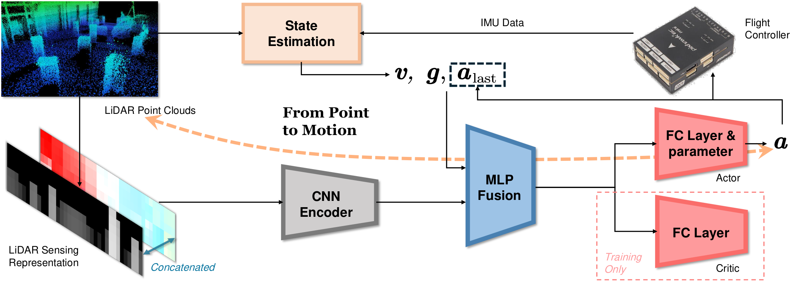

> [!IMPORTANT]
> 🌟 Stay up to date at [arclab.hku.hk](https://arclab.hku.hk/index.html)!


# :mechanical_arm: P2M


<div id="top" align="center">
<p align="center">

</p>
</div>


> #### :page_facing_up: [Paper](https://arxiv.org/abs/2511.16372) | :movie_camera: [Demo](https://arxiv.org/abs/2511.16372) | :rocket: Project Page (Coming Soon)
> :black_nib: Bowen Xu, Zexuan Yan, M. Lu, X. Fan, Y. Luo, Y. Lin, Z. Chen, Y. Chen, Q. Qiao, P. Lu \
> :e-mail: Primary Contact: Bowen Xu (link.bowenxu@connect.hku.hk) and Zexuan Yan (ryan2002@connect.hku.hk)


### :fire: Highlights
- An efficient LiDAR representation combining the depth and environment change sensing.
- A generalizable RL training for dynamic obstacle avoidance.
- A lightweight end-to-end autonomous flight system from point to motion.


## Table of Contents
- [:movie_camera: Demo](#movie_camera-demo)
- [:loudspeaker: News](#loudspeaker-news)
- [:hugs: Model Zoo](#hugs-model-zoo)
- [:video_game: Getting Started](#installation)
- [:fire: Training Recipe](#fire-training-recipe)
  - [Train the P2M policy](#zero-train-the-p2m-policy)  
  - [Adjust the training parameters](#one-adjust-the-training-parameters)
- [:rocket: Testing Guide](#rocket-testing-guide)  
  - [Test the P2M policy](#zero-test-the-p2m-policy)
  - [Adjust the testing environment](#one-adjust-the-testing-environment)
- [:pencil: Citation](#pencil-citation)
- [:nerd_face: Acknowledgments](#nerd_face-acknowledgments)


## :movie_camera: Demo
<table style="width:100%;border-collapse:collapse;">
<tr>
  <td colspan="2" style="text-align:center;"><b>Real-world robot experiments (1x speed)</b></td>
</tr>
<tr>
  <td><video src="https://github.com/user-attachments/assets/69006b54-4dff-40f3-84bd-d5d6443e3368" style="object-fit:cover;" autoplay loop muted playsinline></video></td>
  <td><video src="https://github.com/user-attachments/assets/bc950384-9653-44f1-98e1-f517abbceb61" style="object-fit:cover;" autoplay loop muted playsinline></video></td>
</tr>
</table>

## :loudspeaker: News

- **[2025/12]** The code of P2M v1.0 is released. Please check it out!


## :hugs: Model Zoo <a name="hugs-model-zoo"></a>

<table>
  <tr>
    <th>Model Name</th>
    <th>Backbone</th>
    <th>Path</th>
    <th>Note</th>
  </tr>
  <tr>
    <td> p2m-deafult </td>
    <td> CNN+MLP </td>
    <td><a href="https://github.com/arclab-hku/P2M/releases/download/v0.0.1/p2m_default.pt">Release/p2m_model/p2m_default.pt</a></td>
    <td> The p2m model trained from scratch. </td></td>
  </tr>
</table>


## :video_game: Getting Started <a name="installation"></a>
### :zero: We use conda to manage the environment
```bash
# Create the conda environment
conda create -n p2m python=3.10
conda activate p2m
cp -r conda_setup/etc $CONDA_PREFIX

# Activate the conda environment
conda activate p2m
conda config --add channels conda-forge
conda config --set channel_priority strict
```
### :one: Install Isaac Sim and Isaac Lab
> [!NOTE]
> Please refer to [this doc](assets/install_isaac.md) for an example of how to install isaac sim and isaac lab

### :two: Install dependencies

```bash
# Install the project in editable mode at the project root
pip install --upgrade pip
pip install -e .

# Install additional dependencies
pip install setproctitle huggingface_hub
pip install usd-core==23.11 lxml==4.9.4 tqdm xxhash
pip install torch==2.2.0 torchvision==0.17.0 torchaudio==2.2.0 --index-url https://download.pytorch.org/whl/cu118
pip install tensordict==0.3.2 --no-deps 
```

### :three: Build the repository
```bash
catkin build
```

### :four: Download the pretrained models
- [**p2m_default.pt**](https://github.com/arclab-hku/P2M/releases/download/v0.0.1/p2m_default.pt): The pretrained p2m policy model, for testing only. Put it into ```./models```. 
- [**neuflow_mixed.pth**](https://github.com/neufieldrobotics/NeuFlow_v2/blob/master/neuflow_mixed.pth): The pretrained flow estimation model, for training and testing. Put it into ```./resources/NeuFlow_v2```. 


## :fire: Training Recipe  <a name="fire-training-recipe"></a>
### :zero: Train the P2M policy  <a name="zero-train-the-p2m-policy"></a>
```bash
cd scripts
python train.py
```
### :one: Adjust the training parameters  <a name="one-adjust-the-training-parameters"></a>
Fill in your wandb infomation in ```./scripts/config/train.yaml```.
```yaml
wandb:
  entity: # your worksapce name
  project: # your project name
```
> [!NOTE]
> more parameters can be adjusted in ```./scripts/config/train.yaml``` (training) and ```./cfg/task/train_env.yaml``` (environment).


## :rocket: Testing Guide  <a name="rocket-testing-guide"></a>
### :zero: Test the P2M policy   <a name="zero-test-the-p2m-policy"></a>
```bash
# Terminal 1
source devel/setup.bash
roslaunch map_generator sim_test.launch
```
```bash
# Terminal 2
source devel/setup.bash
roslaunch lidar scanner.launch
```
```bash
# Terminal 3
conda activate p2m
cd scripts
python infer.py
```
Use the ```2D Nav Goal``` to trigger the flight!
### :one: Adjust the testing environment   <a name="one-adjust-the-testing-environment"></a>
To change the obstacle number and density in ```./src/uav_simulator/map_generator/launch/sim_test.launch```
```xml
<!-- static obstacle number -->
<param name="map/obs_num" value=""/>
<!-- dynamic obstacle number --> 
<param name="map/moving_obs_num" value=""/>
```

<table style="width:100%;border-collapse:collapse;">
<tr>
  <td colspan="2" style="text-align:center;"><b>Testing in different obstacle densities (1x speed)</b></td>
</tr>
<tr>
  <td><video src="https://github.com/user-attachments/assets/c805d8b8-af65-4eed-8f29-b52ebcf7a0a6" style="object-fit:cover;" autoplay loop muted playsinline></video></td>
  <td><video src="https://github.com/user-attachments/assets/aae63f30-7142-4331-900e-5153a3d8194d" style="object-fit:cover;" autoplay loop muted playsinline></video></td>
</tr>
</table>

> [!NOTE]
> more parameters can be adjusted in ```./scripts/infer.py``` (checkpoint and goal) and ```./src/uav_simulator/map_generator/launch/sim_test.launch``` (environment).


## :pencil: Citation   <a name="pencil-citation"></a>
If you find our code or models useful in your work, please cite [our paper](https://ieeexplore.ieee.org/document/11248899):

```bibtex
@ARTICLE{xu2025flow,
  title={Flow-Aided Flight Through Dynamic Clutters From Point to Motion},
  author={Xu, Bowen and Yan, Zexuan and Lu, Minghao and Fan, Xiyu and Luo, Yi and Lin, Youshen and Chen, Zhiqiang and Chen, Yeke and Qiao, Qiyuan and Lu, Peng},
  journal={IEEE Robotics and Automation Letters}, 
  year={2025},
  publisher={IEEE}
}

```


## :nerd_face: Acknowledgments   <a name="nerd_face-acknowledgments"></a>

We would like to express our gratitude to the following projects, which have provided significant support and inspiration for our work:
- [OmniDrones](https://github.com/btx0424/OmniDrones): Underlying training toolchain for reinforcement learning on multicopters.
- [NeuFlow v2](https://github.com/neufieldrobotics/NeuFlow_v2): Robust and efficient neural optical flow estimation on edge devices.


